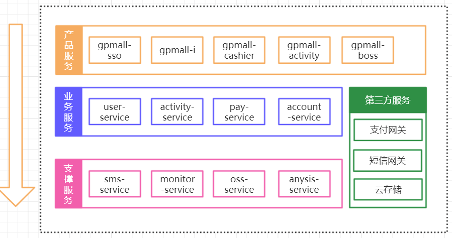

# Gupao-mall

> 计划整合vip课程所有技术，来实现相关业务的整合。主要目的不是为了要完成一个具体项目，而是通过项目更进一步了解技术所要解决的问题。

**整个项目不会在课堂上完全讲解，而是需要大家能够参与到项目中来，在实现业务功能的同时把遇到的问题整理出来，提交到issue上。帮助大家以一个健康的方式快速成长**

`项目的搭建过程是结合课程中同步讲的，所以后面进来的同学不清楚项目怎么运行，如果有条件的同学可以看看之前的分布式的视频；如果暂时没太多时间去补之前的视频，那么跟着第二轮来听课，听完以后就知道项目是怎么来的了！项目主要是帮助没有接触过分布式领域的同学做一些实战帮助他们建立这样的意识；当然也会结合讲过的技术怎么运用在实际中做一些真实场景的演示；当最终你们进入到互联网公司或者涉及到分布式架构的公司里面，你们每天接触的都是这样一个模型的项目，也就不存在要不要实战项目的问题了。`

## 项目的目的（这些都会在课堂中间讲到具体某个知识的时候去分析）

> 帮助大家对分布式架构和应用有一个整体认识
> 明白自己学到的技术真正应用到实战中是如何去解决问题的
> 帮助大家建立解决问题的思路

# 架构图

## 模块

# 代码更新进度

1. 完成单点登录开发
2. 完成转盘抽奖域的设计
3. 完成收银台页面及业务领域模块的构建
4. 支付模块的代码设计和开发
5. 抽奖模块的核心代码开发及表结构设计（待测试）
6. 支付宝接口联调（由于域名环境还没准备好，还没有正式调通）
7. 增加assembly打包功能
8. 完成支付宝、微信的回调逻辑的代码开发

# 使用技术
使用Dubbo+spring 构建整个项目

Maven构建项目

Jenkins作为持续集成

使用 Apollo 配置中心

使用Spring+Spring MVC+MyBatisSSM框架

数据库连接池使用druid

数据库使用MySQL和Redis

前后端完全分离

采用ElasticSearch实现搜索服务

负载均衡使用Nginx、keepalived实现高可用

消息中间件采用ActiveMQ

在分布式事务上则采用了TCC解决时效性要求性高的分布式事务

可靠的消息服务则来解决时效性要求低的分布式事务.

# 服务列表服务

| 项目      |  描述 | 端口 | 备注  |
| :-------- | --------:| :--: | ---- |
| gpmall-activity | 产品服务子域 转盘抽奖 | 8081 |  转盘抽奖 |
| gpmall-common | 无须运行，直接添加到依赖 |  无  |  公共服务包  |
| gpmall-parent | 父控项目，用来管理mave依赖的jar的版本 | 无 | 父控  |
| gpmall-sso  | 对应产品服务 登录子域,tomcat运行 | 8080 | 登录子域 |
| user-service | 对应核心业务服务子域`用户服务`，dubbo服务 | 20880 | 用户服务 |
| gpmall-cashier | 收银台服务 | 8082 | 收银台 |
| activity-service | dubbo服务 | 20881 | 营销平台 |
| pay-service | 支付核心-dubbo服务 | 20882 | 支付核心 |
|  |  |  |  |

# 部署说明

1. 需要先构建基础服务，讲gpmall-common/gpmall-parent这两个基础服务先install到本地私服
2. 启动dubbu服务，user-service 。 暂时需要依赖zookeeper
3. 运行相应的产品服务，gpmall-sso/gpmall-activity/gpmall-cashier等